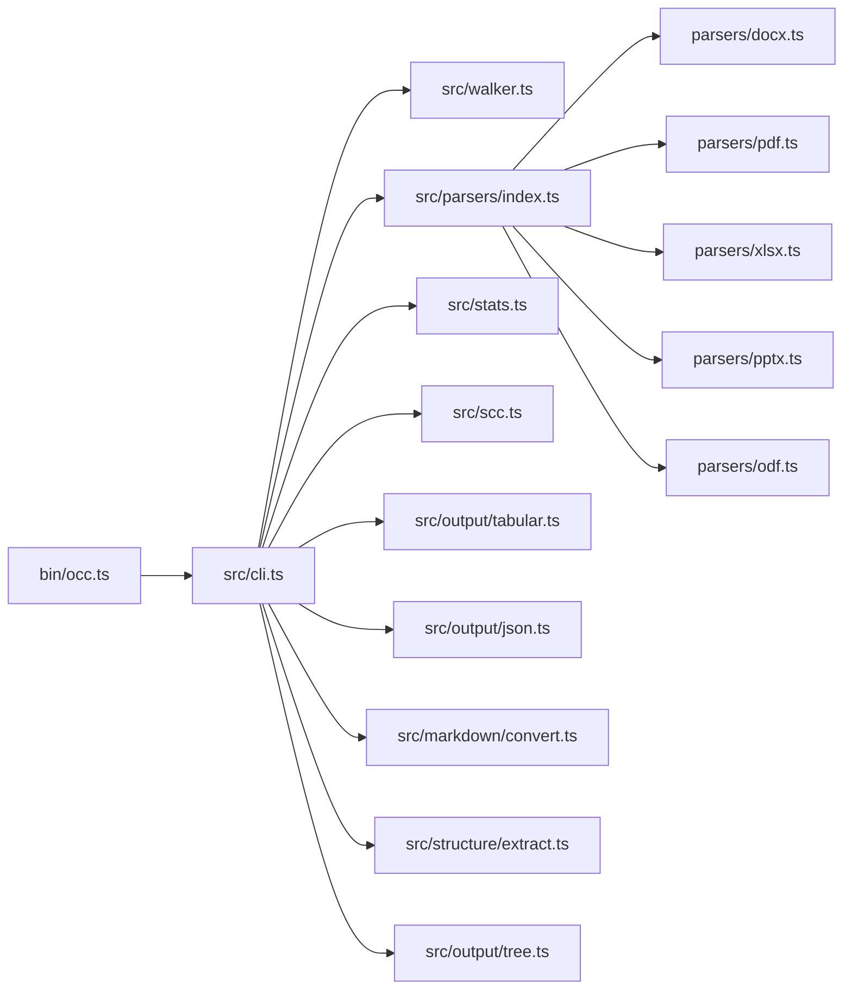
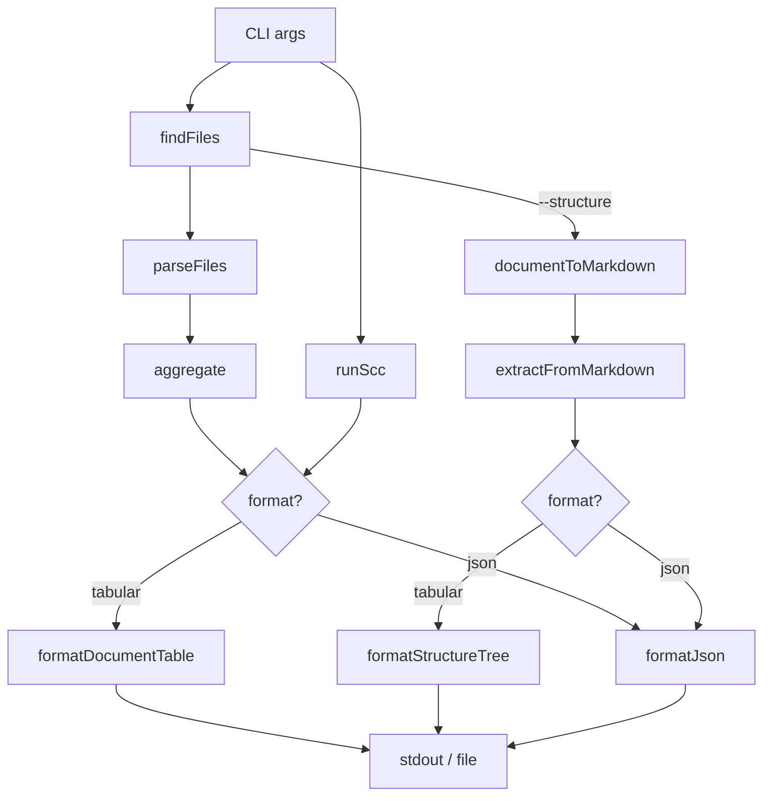

# Architecture Overview

OCC is a TypeScript ES module (`"type": "module"`) CLI tool. Source files live as `.ts` under `src/` and `bin/`, compiled to `dist/` via `tsc`. The `scripts/postinstall.js` remains plain JS (runs before devDeps are available).

## Module Flow



## Data Flow



## Source Tree

```
occ/
├── bin/occ.ts              # Entry point — calls cli.run()
├── src/
│   ├── cli.ts              # Orchestrator — arg parsing, pipeline
│   ├── types.ts            # Shared interfaces (FileEntry, ParseResult, etc.)
│   ├── walker.ts           # File discovery via fast-glob
│   ├── parsers/
│   │   ├── index.ts        # Routes to format-specific parser
│   │   ├── docx.ts         # mammoth (words, pages, paragraphs)
│   │   ├── pdf.ts          # pdf-parse (words, pages)
│   │   ├── xlsx.ts         # SheetJS/xlsx (sheets, rows, cells)
│   │   ├── pptx.ts         # JSZip + officeparser (words, slides)
│   │   └── odf.ts          # JSZip + officeparser (odt/ods/odp)
│   ├── markdown/
│   │   └── convert.ts      # Document → markdown conversion
│   ├── structure/
│   │   ├── types.ts        # StructureNode, DocumentStructure, PageMapping
│   │   ├── extract.ts      # Header extraction + tree building
│   │   └── index.ts        # Re-exports
│   ├── stats.ts            # Aggregation, sorting, column detection
│   ├── scc.ts              # Finds/invokes vendored or PATH scc binary
│   ├── progress.ts         # Progress bar with ETA
│   ├── utils.ts            # Shared helpers
│   └── output/
│       ├── tabular.ts      # cli-table3 terminal tables
│       ├── json.ts         # JSON output
│       └── tree.ts         # Structure tree formatter
├── dist/                   # Compiled output (generated by `npm run build`)
├── scripts/postinstall.js  # Downloads scc binary for current platform
└── vendor/                 # Vendored scc binary (auto-downloaded)
```

## Key Design Decisions

- **TypeScript with strict mode** — the entire codebase uses TypeScript with `strict: true`, compiled via `tsc` to `dist/`
- **ES modules** — native ES module syntax (`import`/`export`), set via `"type": "module"` in `package.json`
- **Dual-path support** — `import.meta.url`-based path resolution works from both `src/` (dev via tsx) and `dist/src/` (built)
- **Batch concurrency** — files are parsed 10 at a time using chunked `Promise.allSettled` to balance throughput and memory usage
- **Auto-detected columns** — the output table columns are determined dynamically based on which metrics actually have data (e.g., the "Details" column only appears when paragraphs, sheets, or slides are present)
- **Vendored scc** — the scc binary is auto-downloaded during `npm install` for zero-config code metrics, with PATH fallback if the download fails
- **Structure extraction pipeline** — documents are converted to markdown first (mammoth + turndown for DOCX, pdf-parse with page markers for PDF), then headers are extracted and assembled into a tree. This two-stage approach reuses existing parser dependencies and produces a uniform intermediate format
