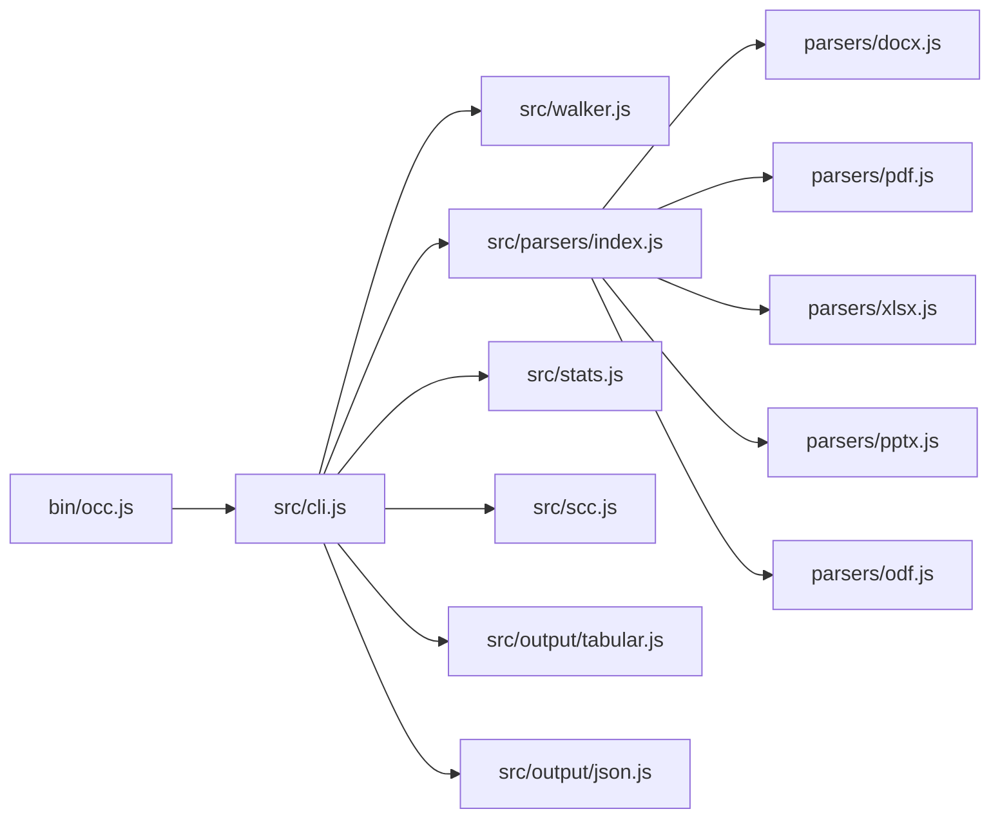
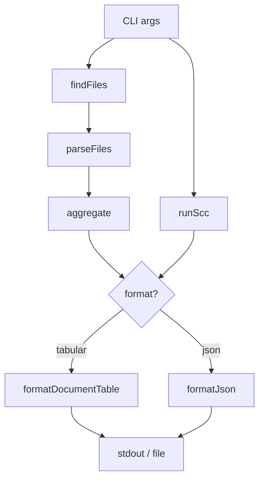

# Architecture Overview

OCC is an ES module (`"type": "module"`) CLI tool with no build step. Source files run directly via Node.js.

## Module Flow



## Data Flow



## Source Tree

```
occ/
├── bin/occ.js              # Entry point — calls cli.run()
├── src/
│   ├── cli.js              # Orchestrator — arg parsing, pipeline
│   ├── walker.js           # File discovery via fast-glob
│   ├── parsers/
│   │   ├── index.js        # Routes to format-specific parser
│   │   ├── docx.js         # mammoth (words, pages, paragraphs)
│   │   ├── pdf.js          # pdf-parse (words, pages)
│   │   ├── xlsx.js         # SheetJS/xlsx (sheets, rows, cells)
│   │   ├── pptx.js         # JSZip + officeparser (words, slides)
│   │   └── odf.js          # JSZip + officeparser (odt/ods/odp)
│   ├── stats.js            # Aggregation, sorting, column detection
│   ├── scc.js              # Finds/invokes vendored or PATH scc binary
│   ├── progress.js         # Progress bar with ETA
│   ├── utils.js            # Shared helpers
│   └── output/
│       ├── tabular.js      # cli-table3 terminal tables
│       └── json.js         # JSON output
├── scripts/postinstall.js  # Downloads scc binary for current platform
└── vendor/                 # Vendored scc binary (auto-downloaded)
```

## Key Design Decisions

- **ES modules** — the entire codebase uses native ES module syntax (`import`/`export`), set via `"type": "module"` in `package.json`
- **No build step** — source files run directly via Node.js, no transpilation or bundling needed
- **Batch concurrency** — files are parsed 10 at a time using chunked `Promise.allSettled` to balance throughput and memory usage
- **Auto-detected columns** — the output table columns are determined dynamically based on which metrics actually have data (e.g., the "Extra" column only appears when paragraphs, sheets, or slides are present)
- **Vendored scc** — the scc binary is auto-downloaded during `npm install` for zero-config code metrics, with PATH fallback if the download fails
