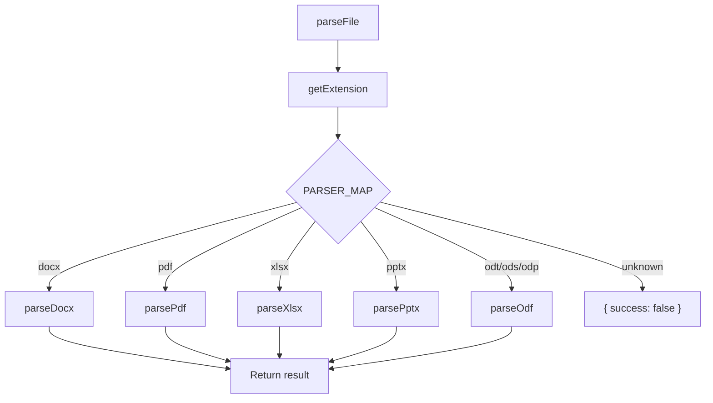

# Parser System

OCC has two parser families:

- **Office document parsers** for metrics and structure extraction
- **Code parsers** for the `occ code` graph builder

The document parser system extracts metrics from DOCX, PDF, XLSX, PPTX, and ODF files. The code parser system normalizes supported source languages into one graph model so the CLI can run the same queries across multiple languages.

## Office Parser Interface

Every parser function implements the `ParserOutput` interface defined in `src/types.ts`:

```typescript
interface ParserOutput {
  fileType: string;              // Display name for the format
  metrics: Record<string, number>;  // Only populated fields (e.g., { words: 5200, pages: 21 })
}
```

The router in `parsers/index.ts` wraps each result with file metadata:

```typescript
interface ParseResult {
  filePath: string;
  size: number;
  success: boolean;              // false if parsing failed
  fileType: string;
  metrics: Record<string, number> | null;
}
```

## Office Dispatch Flow



## PARSER_MAP

The extension-to-parser mapping in `parsers/index.ts`:

```typescript
const PARSER_MAP: Record<string, ParserFn> = {
  docx: parseDocx,
  pdf:  parsePdf,
  xlsx: parseXlsx,
  pptx: parsePptx,
  odt:  parseOdf,
  ods:  parseOdf,
  odp:  parseOdf,
};
```

Note that `odt`, `ods`, and `odp` all route to the same `parseOdf` function, which internally dispatches based on the file extension.

## Batch Concurrency

`parseFiles()` processes files in batches of 10 using `Promise.allSettled`:

```typescript
for (let i = 0; i < files.length; i += concurrency) {
  const batch = files.slice(i, i + concurrency);
  const results = await Promise.allSettled(
    batch.map(f => parseFile(f.path, f.size))
  );
  // collect results...
}
```

`Promise.allSettled` is used instead of `Promise.all` so that a single failing file doesn't abort the entire batch.

## Error Handling

When a parser throws an exception, `parseFile()` catches it and returns a result with `success: false` and `metrics: null`. These "Unreadable" entries still appear in the output (highlighted in red in tabular mode) so the user knows which files failed.

If `Promise.allSettled` itself reports a rejected promise (which shouldn't happen since `parseFile` catches internally), it falls back to an "Unreadable" entry as well.

## Code Parser System

The `occ code` pipeline lives under `src/code/` and normalizes multiple languages into one graph shape:

- `discover.ts` finds supported code files
- `parsers.ts` extracts symbols, imports, calls, and inheritance
- `build.ts` resolves those parsed facts into nodes and edges
- `query.ts` answers CLI-level questions from the in-memory graph

The `0.3.0` release is strongest for:

- JavaScript
- TypeScript
- Python

### Normalized Parsed Facts

Regardless of language, the parser layer tries to emit the same kinds of facts:

- symbols: functions, classes, and variables
- imports: specifier, bindings, and best-known import kind
- calls: caller, callee, qualifier, and source line
- inheritance: child class, base class, and source line

Those facts are still pre-resolution. `build.ts` then converts them into graph nodes and edges and assigns resolution status.

### JavaScript and TypeScript

JS and TS files are parsed with the TypeScript compiler API. That path currently handles:

- function declarations
- arrow functions and function expressions assigned to variables
- class declarations and methods
- `import` declarations and bindings
- `extends` relationships
- call expressions, including qualified calls like `this.foo()` and `super.foo()`

### Python

Python files use a lighter-weight parser path built around line-oriented extraction and import helpers. That path is currently tuned for:

- top-level functions and classes
- methods under classes
- `import ...` and `from ... import ...` statements
- class inheritance
- common method receivers like `self` and `cls`

Relative and repo-local imports are resolved through repository-aware helpers in `languages.ts`.

### Resolution Behavior

The graph builder resolves parsed facts into edges with explicit status:

- `resolved` when OCC can confidently connect the relationship
- `ambiguous` when multiple candidates match
- `unresolved` when a target cannot be connected

That explicit status is part of the contract. OCC prefers surfacing uncertainty to inventing a definitive answer.

Key behaviors in the current code parser and resolver layer:

- **Receiver-aware method resolution** for `this`, `super`, `self`, and `cls`
- **Ambiguity tracking** with candidate locations for uncertain call targets
- **Dependency categorization** into local, external, and unresolved imports
