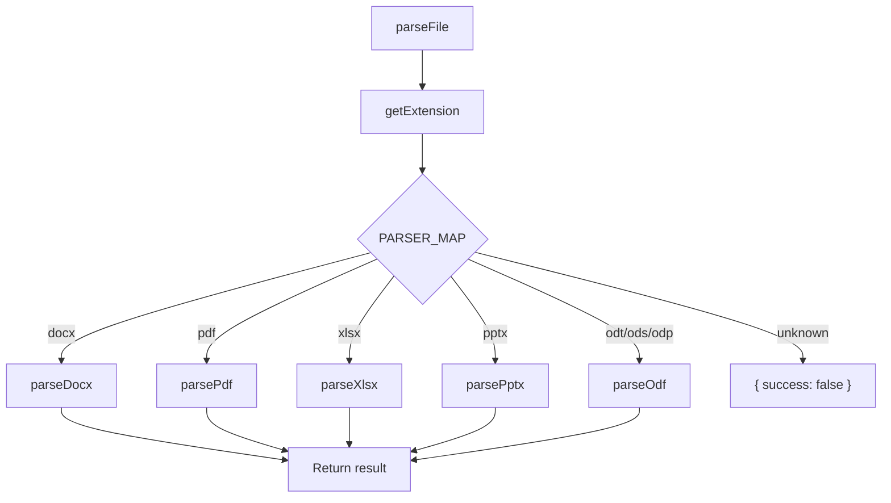

# Parser System

The parser system is responsible for extracting metrics from office documents.

## Parser Interface

Every parser function implements the `ParserOutput` interface defined in `src/types.ts`:

```typescript
interface ParserOutput {
  fileType: string;              // Display name for the format
  metrics: Record<string, number>;  // Only populated fields (e.g., { words: 5200, pages: 21 })
}
```

The router in `parsers/index.ts` wraps each result with file metadata:

```typescript
interface ParseResult {
  filePath: string;
  size: number;
  success: boolean;              // false if parsing failed
  fileType: string;
  metrics: Record<string, number> | null;
}
```

## Dispatch Flow



## PARSER_MAP

The extension-to-parser mapping in `parsers/index.ts`:

```typescript
const PARSER_MAP: Record<string, ParserFn> = {
  docx: parseDocx,
  pdf:  parsePdf,
  xlsx: parseXlsx,
  pptx: parsePptx,
  odt:  parseOdf,
  ods:  parseOdf,
  odp:  parseOdf,
};
```

Note that `odt`, `ods`, and `odp` all route to the same `parseOdf` function, which internally dispatches based on the file extension.

## Batch Concurrency

`parseFiles()` processes files in batches of 10 using `Promise.allSettled`:

```typescript
for (let i = 0; i < files.length; i += concurrency) {
  const batch = files.slice(i, i + concurrency);
  const results = await Promise.allSettled(
    batch.map(f => parseFile(f.path, f.size))
  );
  // collect results...
}
```

`Promise.allSettled` is used instead of `Promise.all` so that a single failing file doesn't abort the entire batch.

## Error Handling

When a parser throws an exception, `parseFile()` catches it and returns a result with `success: false` and `metrics: null`. These "Unreadable" entries still appear in the output (highlighted in red in tabular mode) so the user knows which files failed.

If `Promise.allSettled` itself reports a rejected promise (which shouldn't happen since `parseFile` catches internally), it falls back to an "Unreadable" entry as well.
