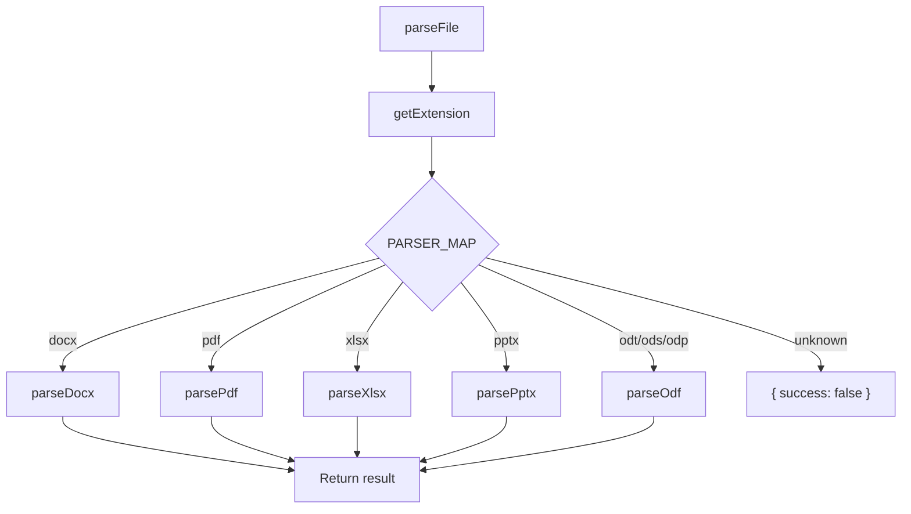

# Parser System

The parser system is responsible for extracting metrics from office documents.

## Parser Interface

Every parser function returns an object with this shape:

```javascript
{
  fileType: 'Word',       // Display name for the format
  metrics: {
    words: 5200,          // Word count (null if not applicable)
    pages: 21,            // Page count (null if not applicable)
    paragraphs: 82,       // Paragraph count (null if not applicable)
    sheets: null,         // Sheet count (null if not applicable)
    rows: null,           // Row count (null if not applicable)
    cells: null,          // Cell count (null if not applicable)
    slides: null,         // Slide count (null if not applicable)
  }
}
```

The router in `parsers/index.js` wraps each result with file metadata:

```javascript
{
  filePath: '/path/to/file.docx',
  size: 45056,
  success: true,          // false if parsing failed
  fileType: 'Word',
  metrics: { ... }
}
```

## Dispatch Flow



## PARSER_MAP

The extension-to-parser mapping in `parsers/index.js`:

```javascript
const PARSER_MAP = {
  docx: parseDocx,
  pdf:  parsePdf,
  xlsx: parseXlsx,
  pptx: parsePptx,
  odt:  parseOdf,
  ods:  parseOdf,
  odp:  parseOdf,
};
```

Note that `odt`, `ods`, and `odp` all route to the same `parseOdf` function, which internally dispatches based on the file extension.

## Batch Concurrency

`parseFiles()` processes files in batches of 10 using `Promise.allSettled`:

```javascript
for (let i = 0; i < files.length; i += concurrency) {
  const batch = files.slice(i, i + concurrency);
  const results = await Promise.allSettled(
    batch.map(f => parseFile(f.path, f.size))
  );
  // collect results...
}
```

`Promise.allSettled` is used instead of `Promise.all` so that a single failing file doesn't abort the entire batch.

## Error Handling

When a parser throws an exception, `parseFile()` catches it and returns a result with `success: false` and `metrics: null`. These "Unreadable" entries still appear in the output (highlighted in red in tabular mode) so the user knows which files failed.

If `Promise.allSettled` itself reports a rejected promise (which shouldn't happen since `parseFile` catches internally), it falls back to an "Unreadable" entry as well.
