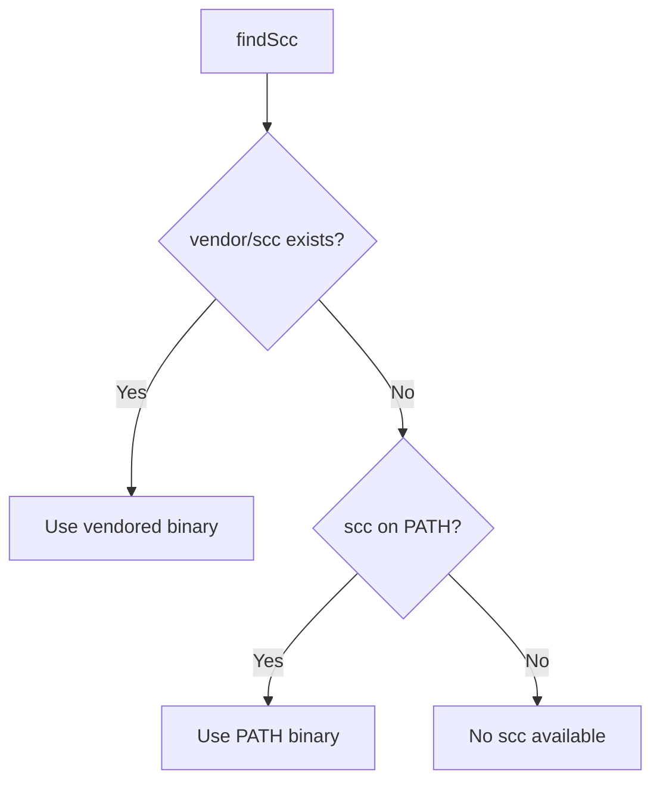

# scc Integration

OCC uses [scc](https://github.com/boyter/scc) (Succinct Code Counter) for code metrics. The integration is implemented in `src/scc.ts`. This page explains how scc is found, invoked, and integrated.

## Binary Resolution

scc is located using a two-step fallback:



1. **Vendored binary** — `vendor/scc` (or `vendor/scc.exe` on Windows), downloaded during `npm install`
2. **PATH fallback** — if the vendored binary isn't found, OCC runs `which scc` (or `where scc` on Windows)

If neither is found, OCC throws an error (unless `--no-code` is used).

## Postinstall Script

The `scripts/postinstall.js` script runs during `npm install` and downloads scc v3.7.0 from GitHub Releases.

### Platform Support

| Platform | Architecture | Asset |
|----------|-------------|-------|
| macOS | x64 | `scc_Darwin_x86_64.tar.gz` |
| macOS | arm64 | `scc_Darwin_arm64.tar.gz` |
| Linux | x64 | `scc_Linux_x86_64.tar.gz` |
| Linux | arm64 | `scc_Linux_arm64.tar.gz` |
| Windows | x64 | `scc_Windows_x86_64.zip` |
| Windows | arm64 | `scc_Windows_arm64.zip` |

### Skipping the Download

Set `SCC_SKIP_DOWNLOAD=1` to skip the automatic download:

```bash
SCC_SKIP_DOWNLOAD=1 npm install
```

The download is also skipped if the binary already exists at `vendor/scc`.

If the download fails (network issues, unsupported platform), the postinstall script exits gracefully — `npm install` still succeeds, and OCC falls back to PATH at runtime.

## How scc Is Invoked

OCC runs scc as a subprocess via `child_process.execFile` (in `src/scc.ts`) with `--format json` to get structured output:

```
scc --format json \
    --exclude-ext docx,xlsx,pptx,pdf,odt,ods,odp \
    [--by-file] [--ci] [--no-gitignore] \
    [--exclude-dir <dir>]... \
    [-s <sort>] \
    <directories...>
```

Key details:

- **Office extensions excluded** — scc is told to skip all 7 office extensions so there's no overlap with OCC's document metrics
- **JSON output** — the raw JSON from scc is parsed and either rendered as a tabular code table or included in the JSON output
- **Same flags forwarded** — `--by-file`, `--ci`, `--no-gitignore`, `--exclude-dir`, and `--sort` are forwarded to scc
- **Sort mapping** — OCC's `--sort words` maps to scc's `-s lines` since scc doesn't have a "words" concept
- **Timeout** — scc is given a 60-second timeout and a 50 MB output buffer
